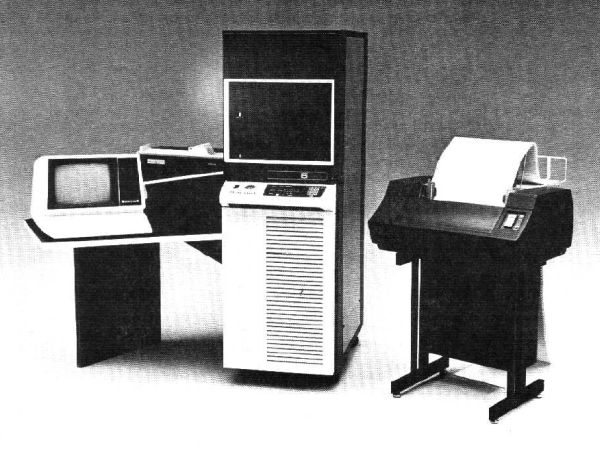

# Intent

This site is intended to introduce humanities research writers how to write text in a modern fashion using their computers. The aim of the lessons listed below  are points of departure for the practice of writing text using simple, basic yet advance systems and technologies. Part of this endeavour is first and foremost to empower writers to use these systems in presenting simple didactic material working towards bootstrapping their understanding of writing technologies and help them develop a new type of literacy (albeit an electronic one). Another goals of this site is to present the historical trajectories of modern writing systems by emphasising on their phylogenesis. Computerised writing systems and related methods (as we will see) have a long history following that of writing itself; the double-valance between the practice of writing and the mode of inscription (technologies) is an important reserach topic in the humanities [@kirschenbaum_mechanisms:_2012, @kittler_discourse_1990].

# Philosophy 

# Scheme

# References
