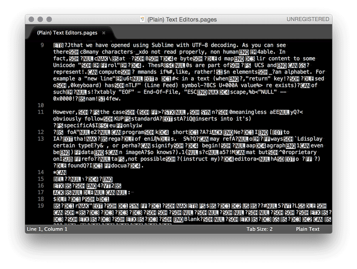

## Text Encoding

We believe in approaching text writing by first understanding the core inscription mechanism upheld by modern computing machine. In this lesson we will hence look at how text and characters are inscribed and represented internally within computers. More specifically we will look at standards of text encoding (and decoding) and see how text editors can decode such encoding. 

### Goals

 The aim of this lesson is to present the various ways that computers represent text internally, that is, characters as digits. The lesson is tailored in giving the reader the basic knowledge of standards that establish the quanta of text (data). Our hope in doing so is to give a feel of a kind of materiality of text and present the ways in which various levels of abstraction are applied to it.

 In a nutshell, the goals of this lesson are:

1. Understand the various ways in which characters are represented and encoded as digits.
2. Derive a basic understanding of how proprietary text formats are encoded.
3. Develop a critical stance on why proprietary text formats might be problematic.
4. Develop a critical stance on why standardized open text formats are important and ubiquitous.
5. Learn how to use a plain text editor to write, view and inspect different open standards encodings of a given text file.

### History

As everyone heard of the byte format? If you didn't it's about time you do as you employ this legacy format daily when using your computer. A byte is the most basic quanta of computing and is composed of 8 bits, where a bit stands for what is commonly represented by a 0 or 1. Hence a byte is a 8-bits "packet" which can represent decimal numbers ranging from 0 to 255 (or -128 to 127). In this lesson we will use the [Hexadecimal](https://en.wikipedia.org/wiki/Hexadecimal) notation to represent bytes. A byte is an historical format and encapsulate the most basic data structure in computing machinery, a standard introduced by IBM for its flagship [IBM/360](http://www.computermuseum.li/Testpage/IBM-360-1964.htm) mainframe machine in 1964.[^1] 

Roughly at the same time (1963) another (updated) standard was devised for the encoding of characters: ASCII [ref]. ASCII conceived a 7-bit format for characters that was factorised into an 8-bit format on the IBM/360. With a 7-bit format, ASCII had the possibility to encode 127 characters. However, the IBM/360 opted to use the legacy [EBCDIC](https://en.wikipedia.org/wiki/EBCDIC) 8-bit format as default character set (dubbed "charset") on all software developed for the IBM/360[^2]. Hence the mass adoption of ASCII as main default charset in computing systems came years after mainly with the advent of PCs.

Is ASCII still in use today? Yes and no. ASCII has some important limitations as it was designed for Latin-based languages and does not support non-Latin characters (hence a 7-bit format for an Latin alphabet). With the wide spread of PCs around the world and the rise of the Internet as main communication infrastructure, the need for a single character format (albeit a Universal Format) accounting for both Latin and non-Latin characters (Cyrillic, Hebrew, Arabic, Turkish to name a few) was imminent at the beginning for the 90s. 

Hence the establishment of the Unicode standard which aim is to devise and maintain a Universal Character Set (UCS) composed of special codes points for each character (a kind of "meta"-charset if you want, composed of specific unicode codes)[^3]. Unicode does not specify specific encodings for its code points. Rather, encodings are part of specific implementations of the UCS such as UTF (UCS Transformation Format). The most notable UTF being UTF-8.[^4]  The special feature of UTF-8 is that it is directly backward compatible with ASCII (an 8-bit ASCII character as the same encoding as its UTF-8 version) and has the property of being variable in length, meaning that Latin characters are encoded with a single byte while other non-Latin characters may be encoded with up to 4 bytes.[^5] Nowadays, UTF-8 is one of the most (if not _the_ most) mass adopted / ubiquitous character encoding format.[^6] 

### How

Let's start with a very simple example to illustrate how text is encoded.

The following sentence

	this is a sentence encoded in UTF-8.

is equivalent to UTF-8

	7468 6973 2069 7320 6120 7365 6e74 656e 6365 2065 6e63 6f64 6564 2069 6e20 5554 462d 382e

and Unicode 

	U+0074 U+0068 U+0069 U+0073 U+0020 U+0069 U+0073 U+0020 U+0061 U+0020 U+0073 U+0065 U+006e U+0074 U+0065 U+006e U+0063 U+0065 U+0020 U+0065 U+006e U+0063 U+006f U+0064 U+0065 U+0064 U+0020 U+0069 U+006e U+0020 U+0055 U+0054 U+0046 U+002d U+0038 U+002e

Now the same sentence in Vietnamese

	đây là một câu UTF-8.

is equivalent to UTF-8

	c491 c3a2 7920 6cc3 a020 6de1 bb99 7420 63c3 a275 2055 5446 2d38 2e

and Unicode

	U+0111 U+00e2 U+0079 U+0020 U+006c U+00e0 U+0020 U+006d U+1ed9 U+0074 U+0020 U+0063 U+00e2 U+0075 U+0020 U+0055 U+0054 U+0046 U+002d U+0038 U+002e

A few observations from the examples above are worth noting: 

1. For the English sentence, the UTF-8 encoding and Unicode representation are basically the same. This is because what we are looking at is basically straight ASCII! Unicode's UCS was designed to integrate ASCII into it's core coding scheme and hence used the same codes for its Latin-based subset. UTF-8 implements this (obviously) into its encoding scheme.

2. UTF-8 encoding of the English sentence is far more compact then the Unicode UCS. For a single character, UTF-8 utilises two bytes rather than four from the UCS.

3. For the Vietnamese sentence, things get a little more interesting. Here the UTF-8 encoding and Unicode representation are _not_ the same. As explained in the last section, UTF-8 encoding format and Unicode code points are not meant to be equivalent, one is a standard (Unicode) while the other is the implementation of this standard (UTF-8).

4. UTF-8 encoding of the Vietnamese sentence is _not_  necessarily more compact then Unicode's UCS. In fact we see UTF-8 utilising four bytes to encode some characters (remember that UTF-8 is of variable-length). For example the character 'â' is 'U+00e2' in UCS (two significant bytes) while 'c3a2' in UTF-8 (four significant bytes). A great chart to look at the various codes and encoding can be found here: [http://utf8-chartable.de](http://utf8-chartable.de)

At this point, we should stress the fact that what is inscribed in computing memory is the _encoding_ of text and not its Unicode representation. In other words, UTF-8 is the scheme from which computers inscribe text to physical memory using their read/write mechanisms. What is inscribed physically are single bits following the UTF-8 encodings scheme that gives meaning to 8-bit "packets" as characters. In the example above we have employed the hexadecimal notation to represent such "packets"/data. This is, of course, an kind of abstraction from the physical layer where text is actually inscribed, a convenient way for us humans to decipher and group bits. It nonetheless gives us a feel for the type of "materiality" of text inscribed on and manipulated by computing machine. For a more in depth analysis of physical inscription mechanisms, we refer the forensics work of Kirschenbaum [@kirschenbaum_mechanisms_2012] on the subject.

#### (Plain) Text Editors

But how do I go about and start looking up the encoding of a particular text? Well it is pretty simple: don't use word processing software; use a [plain text editor](https://en.wikipedia.org/wiki/Text_editor). For the examples above we've used [Sublime Text](http://www.sublimetext.com)[^7] to manipulate and reveal encodings of our sentences. The idea with plain text editors is that they give it all, they are usually very basic in appearance yet usually have striking features that are central to the practice of computer programming. There exist a panoply of good and powerful text editors[^8] and some are even legacy editors such as [Emacs](https://www.gnu.org/software/emacs/) and [Vi(m)](http://www.vim.org). In this lesson (and the remaining ones) we will use Sublime to illustrate techniques and concept, yet any other editors would suffice without a doubt.

Now equipped with an editor, let's look up what a word processing file looks like: 

To select the encoding of a file using Sublime: __Menu__ -> __File__ -> __Reopen with Encoding__

The above file is an Apple Pages file that we have opened using Sublime with UTF-8 decoding.

As you can see there is many characters that do not read properly, that is, not human readable. In fact, we can see that UTF-8 decodes the bytes in the file and maps their content to some Unicode "control" character. These "control" characters are part of the UCS and are characters representing computer commands if you like, rather than elements of an alphabet. For example a "new line" character representing a new line in a text (when the "return" key is pressed on a keyboard) has a "LF" (Line Feed) symbol with UCS U+000A value. There exists a vaietry of such characters.[^9]

However, in the case of the Apple Pages file, these "control" characters are meaningless as they do not obviously follow the Unicode standard. Instead Pages inserts into it's text specific commands that only have meaning for the Apple Pages program. In short, these are bytes that have meaning only to Apple and their specific regime of encoding files.  Such commands may refer to specific ways to display certain types of characters, or perhaps signify the beginning of a paragraph, or specify a font to render text, or even be the data of an image (who knows?). Pages is not a standard format but a proprietary one, therefore it is not possible to instruct my text editor on how to decode the bytes found in the Pages document. In a sense, in having all data part of a single file (information about the design, layout, font, etc.) it makes the files overly complex compared to plain text format. As a result, word processing files tend to be larger in size than plain UTF-8 encoded ones. The text from the file above has 1 389 characters. Its Apples Pages file is composed of 179 759 bytes while its plain UTF-8 version only 1 391 bytes (two extra bytes for the "EOF" control character).

In turn the obvious unreadability of proprietary word processing file formats (such as Apple Pages, MS Word) coupled with their tendency to bloat file, makes them problematic in terms of politics of encoding, usability and efficiency. Hence, standards like UTF-8 and the use of plain text editors are viable alternative for writing academic text and sustained by a practice that is unbounded by obfuscating interests and techniques. What is human-readable is human-understandable.

### Extra

As an exercise for this lesson, please feel free to experiment with [Sublime Text](http://www.sublimetext.com) (especially its encoding features): __Menu__ -> __File__ -> __Reopen with Encoding__

[Sublime Text 2 Official Documentation](http://www.sublimetext.com/docs/2/)

[Sublime Text 2 Non-Official Documentation](http://sublime-text-unofficial-documentation.readthedocs.org/en/sublime-text-2/)

Note: If you are a plain text editing novice, please make sure you understand just-enough basics to start. Some of the tutorials only are tailored for advanced programmers and their jargon may be confusing at times.

### References

[^1]: The IBM/360 is one of the most sold computer of its time. For a discussion about the 8-bit byte format see _Data Format_ section in [@amdahl_architecture_1964].

[^2]: See section _ASCII vs BCD codes_ in [@amdahl_architecture_1964] and for more information about the history of the ASCII format see the writings of [Bob Bemer](http://www.bobbemer.com/BYTE.HTM).

[^3]: Unicode codes are represented with a 'U' prefix before their numerical codes. For a table of all the codes, refer to [http://unicode-table.com/](http://unicode-table.com/)

[^4]: See also UTF-16, UTF-32 and the Unicode [FAQ](http://www.unicode.org/faq/utf_bom.html) for disambiguation.

[^5]: UTF-8 was conceived by [Ken Thompson](https://en.wikipedia.org/wiki/Ken_Thompson) and [Rob Pike](https://en.wikipedia.org/wiki/Rob_Pike) on a placemat in a [New Jersey diner in 1992](http://www.cl.cam.ac.uk/~mgk25/ucs/utf-8-history.txt).

[^6]: Especially on the Internet -- see character encodings historical trend [chart](http://w3techs.com/technologies/history_overview/character_encoding/ms/y).

[^7]: Although moving to [Atom](https://atom.io) eminently.

[^8]: For a list of such editors please refer to [this article](https://en.wikipedia.org/wiki/Comparison_of_text_editors).

[^9]: For a comprehensible explanation of these codes, please refer to historical [RFC20](https://tools.ietf.org/html/rfc20). The concept of control codes was introduced by legacy [Baudot (1870) and Murray codes (1901)](https://en.wikipedia.org/wiki/Baudot_code) who were standard coding techniques up until the advent of aforementioned EBCDIC and ASCII.