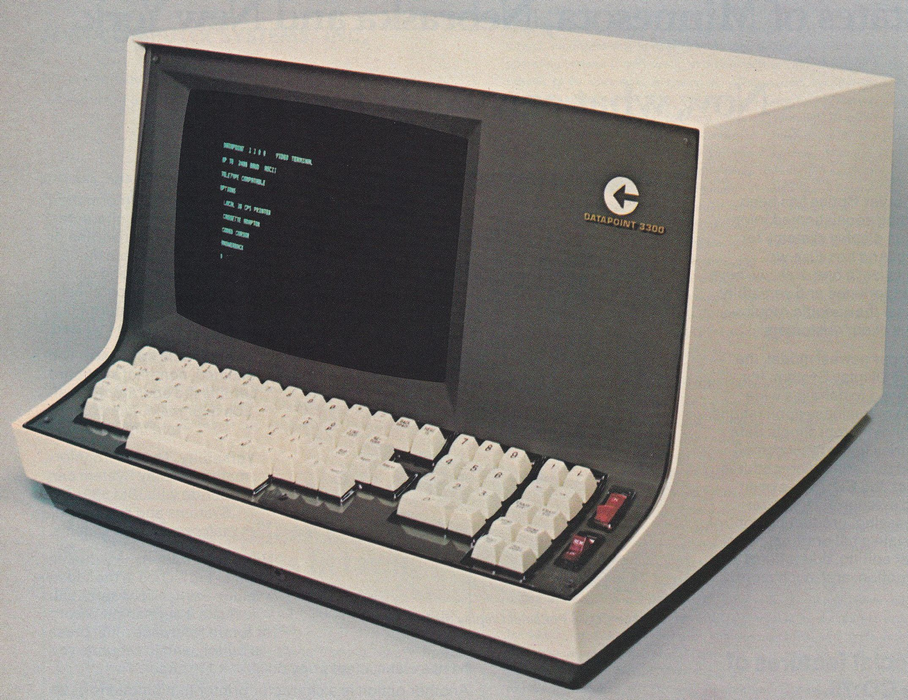

## CLI or the Command Line Interface

The Command Line Interface is the most common and pervasive interface directly linking fingers typing on a keyboard (text) and the computer (commands). The CLI is a legacy mode of operating computing system which can be traced back to early telegraphic devices. In this lesson we will look at your computer's own CLI and present ways in which you can use it to write, manipulate, analyse and transform text on your own computer system.

 

 

### Goals

The aim of this lesson is for readers to develop an appreciation of the advantages of using the CLI for certain types of work involving text editing on a computer. As the CLI itself is text based, our goal is to present the history of the CLI and discuss how text-based computer interfaces are still up to this day on of the most important ways to communicate with the computer systems.

The goals of the lesson are:

1. Understand the historical precedents leading to the development of modern CLI.
2. Acquire basic knowledge on how to operate the CLI of your own computer. 
3. Develop the ability to recognize where and when the CLI is a better alternative than other types of computer interfaces (mainly graphical).
4. Develop a critical perspective on why the CLI matters in some situation and when it does not.
5. Acquire just-enough basic CLI vocabulary to be used in future (research) work.

### History

We can trace back the history of the text-based interface as mode operating computers to the telegraph and of course the typewriter. Years before computing (as we know it) was invented[REF: Turing], the telegraph was already a ubiquitous telecommunication system. Early operators of the telegraph used hand-operated devices, the Morse key, to send Morse codes down the communication cable, an interface that had many limitations due to it's rather crude operation mode. From the mid 19th century on, a few devices were invented that featured a multiple keys keyboard interface and related receiver apparatus that would print messages sent using the keyboard input device. These greatly improved the speed in which messages could be sent and received. However, messages printed using these devices were still encoded raw; a received message would usually be in punched holes format on a piece of paper tape. For this reason, trained operators capable of deciphering such codes were still key interpreters of the wired cables.

It is not until the beginning of the 20th century, with the advent of the Teletype (TTY) [REF: Crumb], that sending and receiving tele-typed text over telegraph lines was fully automated. Quite similar to the typewriter, a TTY made reading and writing encoded text seamless: the teletypewriter would encode typed alphabetic characters and the teletypeprinter would decode received encoded characters in an alphabetic format. Hence sending a message to an endpoint would be as easy as typing on a normal typewriter. This new type of telecommunication interface greatly changed the face of news and print media[REF] as it enable reporters and writers to send and receive "cables" on their own (without the need to be trained operators themselves). 

But why is the history of the TTY important for our concern here? Well there's two major reasons. First, the Teletype was historically important for the development of text encoding ([Lesson1](Lesson1.html)). Early Teletype machines used the Baudot code encoding scheme but Teletype Model 33 (a standard TTY device in the 1960's and 1970's) used the ASCII encoding scheme. For this reason, ASCII (and modern UTF-8) has, still to this days, control codes that refer to networking operational commands. These characters attest the legacy of TTY devices. Second, as a result of ASCII integration in Model 33, the TTY became an central interface to mainframe computing machinery in the 1960's and 1970's. Before the advent of the TTY, the standard computing interface was the punch card format. TTY introduced direct input of computing commands from the teletypewriter and formalised the output as teleprinted on paper (ASCII also have printing control codes). For a long period of time, the main medium of computing was printed paper.[^1]

A quick note here to emphasize the fact that computing was done on mainframes back in these days. The "mainframe" was a "colossus" computer residing somewhere in a local or remote building. As explained above, interfacing with the mainframe was done on a TTY device. This type of topology lead to the term "terminal" to signify a user's endpoint (where the fingers and the eyes are) and "time-sharing" to signify that the mainframe shared its computing time between multiple users and their respective terminals. Much like the early TTY/telegraph coupling, a user would send computing commands on his TTY device over a network cable and receive the results back from the mainframe onto the same device. Rather than "discuss" with another fellow human over the network, you would now "discuss" with the shared computer.

The first terminal to showcase a screen as output device (rather than paper) was the Datapoint 3300 by Computer Terminal Corporation (CTC).[^2] Other than having a glassy CTR screen, the main feature of the Datapoint 3300 was that it could seamlessly replace the Teletype Model 33 terminal and perform paperless the same operations. However, the Datapoint 3300 had obviously different circuitry than the Model 33. In order to drive its CTR monitor, CTC devised special electronic circuitry that kept track of the characters displayed on screen (shift-registers - a type of operational memory). The story goes that CTC, having a need to upgrade its circuitry, asked Intel and Texas Instrument (which are integrated circuit manufacturer) to produce a special ship that would be used to program its future screen-based terminals.[^3] This challenge lead to the development of one Intel's first 8-bit microprocessor - the Intel 8008.[^4]  

The direct descendant of the Datapoint 3300, the Datapoint 2200 was the first programmable terminal, viewed by many as the first personal computer. The fact that the Datapoint 2200 was programmable, meaning that code could be written for and ran on the terminal's circuit itself and not on a mainframe made it very attractive to computer programmers. Commands could be issued on the Command Line Interface and directly resolved locally without the need of an (expensive) mainframe. This were the story of terminals ends. If code is executed locally and not remotly, it is erroneous to talk about a terminal but instead 

No more terminal but he emulation of the mainframe -- same look and feel 

Computer Terminal Corporation -- 
Datapoint3300 --- first video / visual terminal
Datapoint2200 --- emulation of the terminal = PC

Intel 8008 - Intel 8080

1972 UNIX

Microcomputers
1974 CP/M ( "Control Program/Monitor")
DOS
1978 Apple-DOS
1979 Atari-DOS
1981 PC-DOS

### How

Command Line Interface ---> Command Line Interpreter (shell)

Prompt

Commands

Results

### Extra

[^1]: Something that is easily forgotten in the era of ubiquitous computer screens. For a discussion on the topic see Nick Montfort's essay [Continuous Paper: The Early Materiality and Workings of Electronic Literature](http://nickm.com/writing/essays/continuous_paper_mla.html).

[^2]: [Datapoint 3300 brochure](http://archive.computerhistory.org/resources/text/Computer_Terminal_Corporation/ComputerTerminalCorporation.Datapoint3300.1969.102646159.pdf).

[^3]: In fact Victor Poor from CTC devised the architecture and instruction set. The instruction set is, to this day, found (a revised version of course) on Intel's flagship x86 architecture, the most pervasive microprocessor architecture of all time (typing this text was processed by a x86 microprocessor).

[^4]: And subsequently the legacy 8-bit Intel 8080, 16-bit Intel 8086 and the whole x86 family of microprocessors. For all the details of the development of the Intel 8008, please refer to [this document](http://archive.computerhistory.org/resources/access/text/2012/07/102657982-05-01-acc.pdf).
